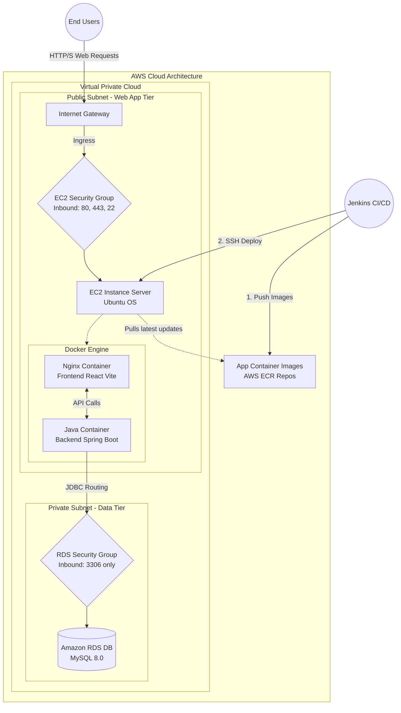

# 🏗️ Infrastructure Overview (AWS & Terraform)

The DC Music application utilizes a fully automated Infrastructure as Code (IaC) approach using **Terraform** to provision highly scalable, secure, and resilient cloud-native resources on **Amazon Web Services (AWS)**.

## 🚀 Architectural Map

Below is a visual representation of how the DC Music application is deployed on AWS. The design adheres to AWS cloud computing best practices, specifically dividing resources logically into **Public** and **Private** subnets to protect the data layer from public exposure.

---

## 🏗️ Detailed Component Breakdown

### 1. 🌐 Networking Foundation (`modules/vpc`)
The foundation of the AWS deployment is a Custom VPC (Virtual Private Cloud) that isolates the application environment.
- **Internet Gateway (IGW):** Attached directly to the VPC to enable inbound and outbound internet traffic.
- **Public Subnets:** Specifically designed to house internet-facing resources, such as our EC2 server. Traffic routed via the IGW.
- **Private Subnets:** Isolated network blocks restricted from the outside internet, routing internal traffic exclusively.

### 2. 🖥️ Computing Tier (`modules/ec2` )
A single EC2 instance is deployed into the Public Subnet to act as the primary application host.
- **Docker Integration:** The EC2 utilizes a `user_data.sh` bash script on startup to automatically install the Docker Engine, AWS CLI, and authenticate with AWS.
- **Container Registry Aggregation:** The EC2 pulls the Docker images (React Frontend and Java Backend) hosted remotely on ECR and mounts them using `docker-compose`. 
- **Environment Configuration:** Terraform dynamically renders required URLs (like the RDS endpoint) directly into the instance environment variables.

### 3. 🗄️ Database Tier (`modules/rds`)
The database is completely shielded from public access.
- **Engine:** Managed Amazon Relational Database Service (RDS) running **MySQL 8.0**.
- **Location:** Placed exclusively inside the **Private Subnets**. It cannot be pinged or accessed via the internet directly. 
- **Durability:** Standard automated backups and snapshot capabilities established.

### 4. 🛡️ Security Boundaries (`modules/security`)
Network access is controlled strictly by stateless Subnet ACLs and stateful Security Groups.
- **EC2 Security Group (Frontend):** 
  - Allows `Port 80/443` (HTTP/HTTPS) from anywhere (`0.0.0.0/0`) for web users.
  - Allows `Port 22` (SSH) exclusively for Jenkins CI/CD execution and Admin access.
- **RDS Security Group (Backend):**
  - Allows `Port 3306` (MySQL) **only** if the request originates organically from the EC2 Security Group ID. Direct connections are blocked.

### 5. 📦 Container Registry (`modules/ecr`)
Standard Elastic Container Registry configuration handling private immutable infrastructure.
- Two distinct repositories are created: one for the `frontend` container, and one for the `backend`. 
- IAM Instance Profiles strictly govern and allow the EC2 server to read these repositories securely without passing explicit long-term keys around.

---

## ⚙️ CI/CD Jenkins Pipeline Topology
1. Developers push code directly to the GitHub Repository.
2. The `Jenkinsfile` workflow detects the commit.
3. Jenkins runs `terraform apply` to ensure the core AWS topology above matches the codebase without configuration drift.
4. Jenkins packages up the Frontend `.dist` folder, and the Backend `.jar` file into Docker containers using the `Dockerfile` in the repository.
5. Jenkins pushes these containers to AWS **ECR** *(Referenced in diagram)*.
6. Finally, Jenkins securely connects into the **EC2 instance** over SSH via port 22. It pulls the updated changes, gracefully stops running containers, and executes `docker-compose up -d` to bring the updated software online.
